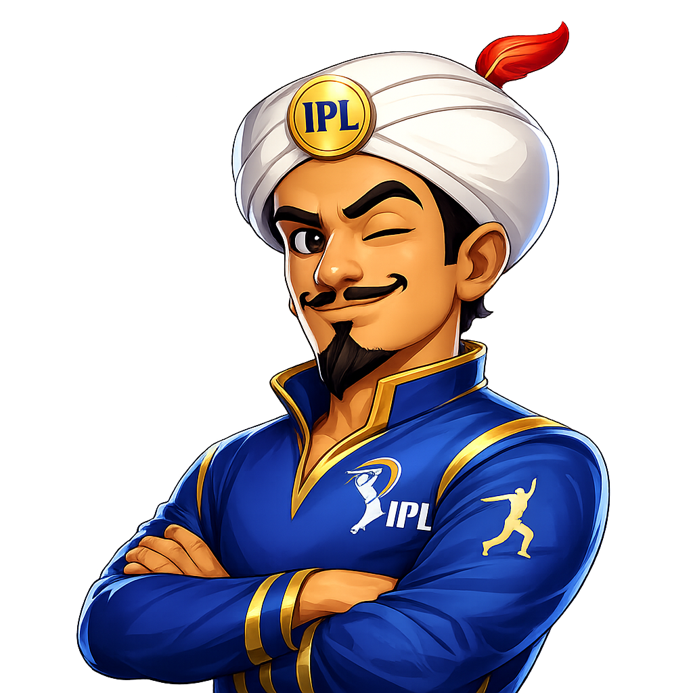

<div align="center">

# 🏏 IPL AKINATOR
### *The Ultimate AI Cricket Mind Reader*

[](https://github.com/nikkita18/IPL_Akinator)
[](https://github.com/nikkita18/IPL_Akinator)
[-brightgreen?style=for-the-badge)](https://github.com/nikkita18/IPL_Akinator)
[](LICENSE)

<br/>



**Think of any IPL cricketer — past legend or current superstar — and watch the Cricket Genie read your mind in just a few strategic questions!**

[Play Now](https://nikkita18.github.io/IPL_Akinator/) • [Features](#-key-features) • [Controls](#-keyboard-shortcuts) • [How It Works](#-how-the-ai-works) • [Local Setup](#-quick-start)

---

</div>

## 🌟 Highlights

IPL Akinator brings the magic of the classic 20-Questions game into a **broadcast-grade stadium HUD**. Featuring modern dark aesthetics, dynamic radar candidate scanning, a holographic player trading card reveal, and native Web Audio SFX.

```
                   ┌────────────────────────────────────────┐
                   │  🎯 "Think of any IPL Cricketer..."    │
                   └──────────────────┬─────────────────────┘
                                      │
                                      ▼
                   ┌────────────────────────────────────────┐
                   │  ⚡ AI asks targeted trait questions   │
                   │  (Role, Team, Nationality, Records...) │
                   └──────────────────┬─────────────────────┘
                                      │
                                      ▼
                   ┌────────────────────────────────────────┐
                   │  🎴 Holographic Trading Card Reveal:   │
                   │    "You are thinking of MS Dhoni!"     │
                   └────────────────────────────────────────┘
```

---

## ✨ Key Features

- 🏟️ **Broadcast-Grade Stadium HUD**: Designed with stadium floodlight ambience, dark glassmorphism, golden accents, and animated scoreboard progress.
- 📡 **Live AI Candidate Radar**: Visual radar sweep animation that simulates real-time filtering through the 100+ IPL player roster.
- 🎴 **Holographic 3D Result Card**: A sports trading card reveal complete with light reflection glare, team colors, jersey numbers, and statistical pills.
- ⌨️ **Full Keyboard Navigation**: Answer questions effortlessly with hotkeys `1` through `5` or classic letters (`Y`, `N`, etc.).
- 🔊 **Native Web Audio SFX**: Dynamic sound effects generated with pure browser Web Audio API — pitch-shifted chimes, clicks, and fanfare (with instant mute toggle).
- ⏪ **Undo & State Rewind**: Made a mistake or changed your mind? Hit **Undo** (or press `U`) to rewind the last question.
- 📱 **Fully Responsive**: Flawless experience across 4K displays, laptops, tablets, and smartphones.
- ⚡ **Zero Framework Overhead**: Built with 100% Vanilla JavaScript, HTML5, and CSS3. No npm installs or build steps needed.

---

## 🎮 Keyboard Shortcuts

Play at lightning speed using your keyboard:

| Key | Action | Description |
|:---:|:---|:---|
| <kbd>1</kbd> or <kbd>Y</kbd> | **Yes** | Confirms the player matches the criteria |
| <kbd>2</kbd> or <kbd>P</kbd> | **Probably** | Leans toward yes |
| <kbd>3</kbd> or <kbd>D</kbd> | **Don't Know** | Neutral / uncertain answer |
| <kbd>4</kbd> or <kbd>O</kbd> | **Probably Not** | Leans toward no |
| <kbd>5</kbd> or <kbd>N</kbd> | **No** | Rules out the criteria |
| <kbd>U</kbd> or <kbd>Backspace</kbd> | **Undo** | Rewinds to the previous question |
| <kbd>M</kbd> | **Mute / Unmute** | Toggles game audio sound effects |

---

## 🧠 How the AI Works

The guessing engine uses an **entropy-minimizing decision tree algorithm**:

1. **Candidate Weighting**: Every IPL player begins with an equal prior probability.
2. **Entropy Scoring**: The engine scans all unused questions and computes which question divides the remaining candidate pool closest to an optimal 50/50 split.
3. **Bayesian State Updates**: Answering moves candidate probabilities according to certainty weights:
   - `Yes` (+1.0)
   - `Probably` (+0.5)
   - `Don't Know` (0.0)
   - `Probably Not` (-0.5)
   - `No` (-1.0)
4. **Convergence**: Once candidate confidence crosses the threshold or question limits are reached, the genie delivers its verdict!

---

## 🗂️ Project Structure

```bash
IPL_Akinator/
├── index.html            # Core application layout & broadcast HUD
├── style.css             # Stadium theme, glassmorphism, animations & cards
├── script.js             # Game engine, decision algorithm, audio & keyboard handlers
├── players.js            # Comprehensive IPL player database & attribute schemas
├── updates.json          # Player updates and patch history
├── assets/
│   ├── akinator-avatar.png   # Genie mascot artwork
│   └── ipl-stadium-bg.jpg    # Stadium atmosphere background
└── images/                   # 100+ optimized portrait photos of IPL players
```

---

## 🚀 Quick Start

No compilers, node modules, or dependencies required!

### Option 1: Direct File Opening
Double-click `index.html` in your browser.

### Option 2: Live Local Server

Using **Python**:
```bash
# Python 3
python -m http.server 8080
```
Then visit `http://localhost:8080` in your web browser.

Using **VS Code**:
- Right-click `index.html` and select **"Open with Live Server"**.

Using **Node.js (npx)**:
```bash
npx serve .
```

---

## 🏏 Supported Cricketers

Includes current superstars and iconic legends across all IPL franchises (CSK, MI, RCB, KKR, RR, SRH, DC, PBKS, GT, LSG):

* 🦁 **Legends**: MS Dhoni, Virat Kohli, Rohit Sharma, AB de Villiers, Suresh Raina, Chris Gayle, Lasith Malinga...
* ⚡ **Modern Stars**: Jasprit Bumrah, Shubman Gill, Ruturaj Gaikwad, Travis Head, Heinrich Klaasen, Rashid Khan, Rinku Singh...
* 🌟 **Emerging Talents**: Yashasvi Jaiswal, Abhishek Sharma, Mayank Yadav, Tilak Varma, Nitish Kumar Reddy...

---

## 🤝 Contributing

Contributions, player suggestions, and UI feature additions are welcome!

1. Fork the Project
2. Create your Feature Branch (`git checkout -b feature/AmazingFeature`)
3. Commit your Changes (`git commit -m 'Add some AmazingFeature'`)
4. Push to the Branch (`git push origin feature/AmazingFeature`)
5. Open a Pull Request

---

## 📄 License

Distributed under the **MIT License**. See `LICENSE` for more information.

<div align="center">

Made with ❤️ and passion for 🏏 **Indian Premier League Cricket**

</div>
